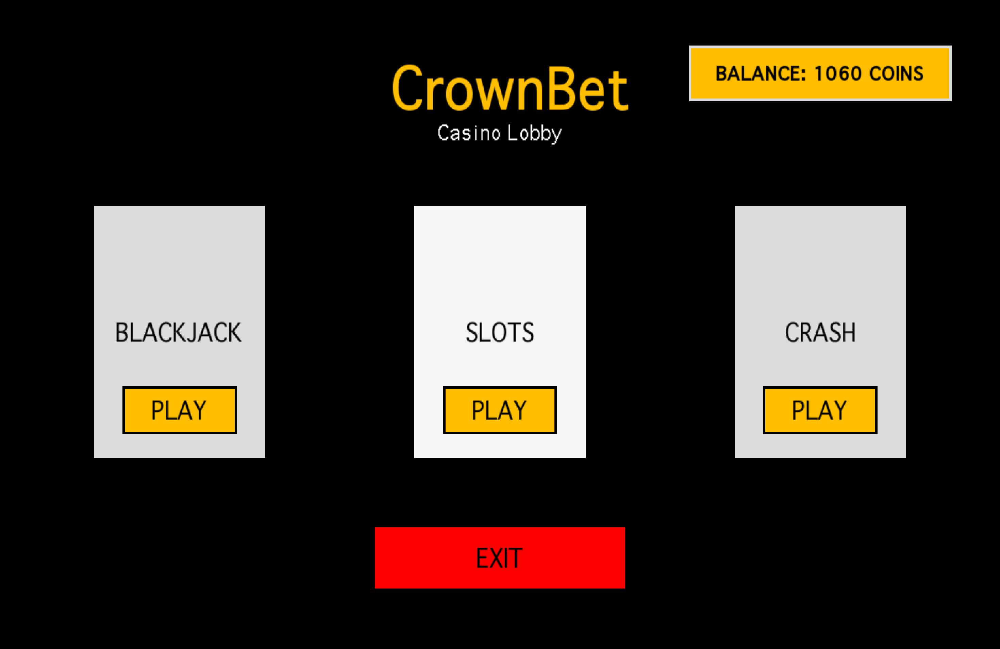
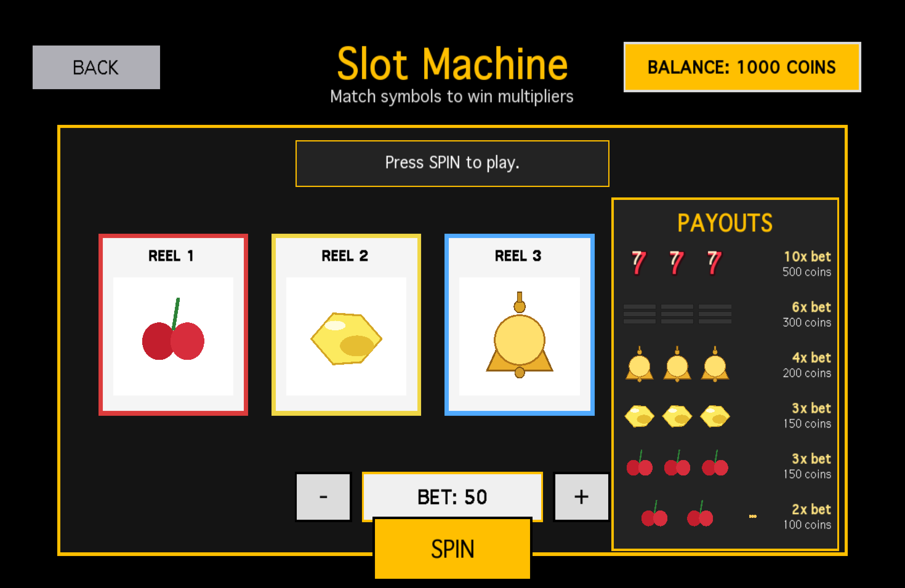
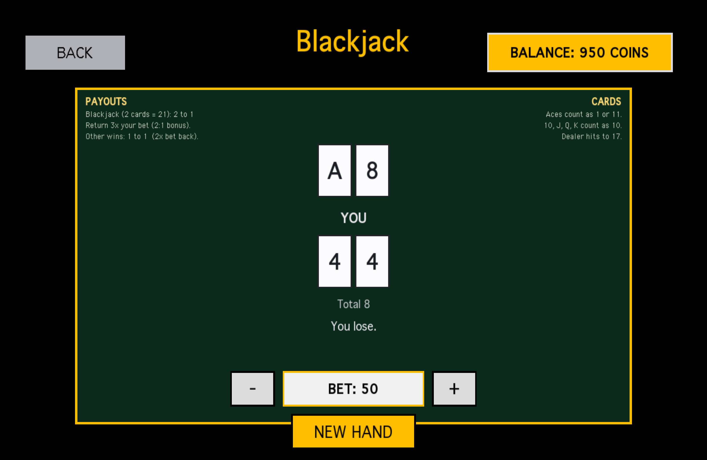
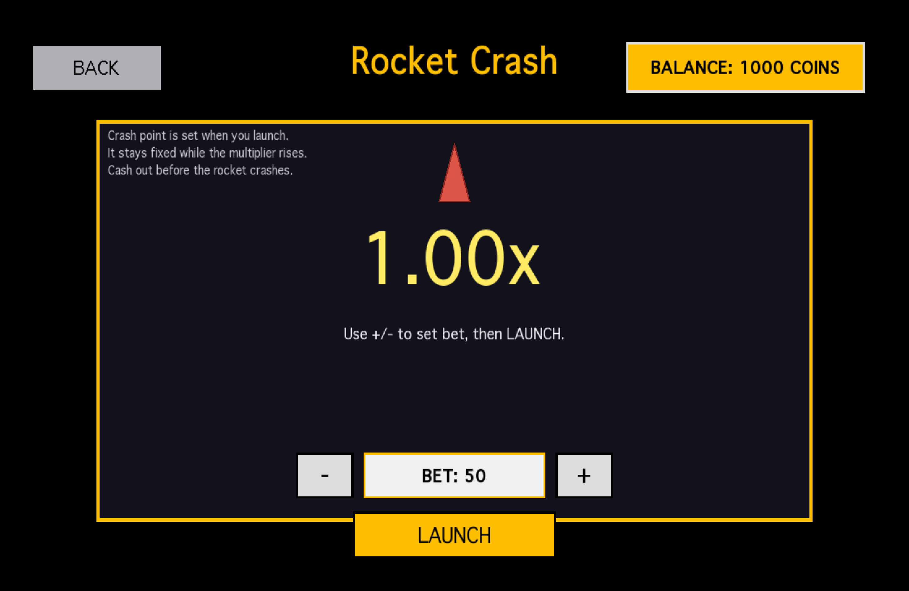

# 🎰 CrownBet Casino

A C++ desktop casino app built with SFML where players wager **crowns** across multiple games. Features a fully playable **Slots** game, a polished main menu, game ruleset screens, and visual mockups for upcoming games.

---

## 🎮 Games

| Game | Status |
|---|---|
| 🎰 Slots | ✅ Complete |
| ✈️ Rocketman | ✅ Complete |
| 🃏 Blackjack | ✅ Complete |

---

## 🚀 Getting Started

### Prerequisites

- **C++17** compiler (e.g. `g++`)
- **SFML 2.x** — install via Homebrew:
  ```bash
  brew install sfml@2
  ```

### Compiling

Run the following from the project root:

```bash
g++ -std=c++17 -Wall -Wextra main.cpp button.cpp crash_game.cpp crash_screen.cpp blackjack_screen.cpp blackjack_game.cpp rng.cpp slots_game.cpp slots_render.cpp -I/opt/homebrew/opt/sfml@2/include -L/opt/homebrew/opt/sfml@2/lib -lsfml-graphics -lsfml-window -lsfml-system -o casino
```

### Running

```bash
./casino
```

---

## 🗂️ Project Structure

```
GROUP35/
├── assets/
│   └── Geneva.ttf              # App font
├── .vscode/
│   └── tasks.json              # VS Code build tasks
├── main.cpp                    # Entry point
├── casino.cpp                  # Core casino / app loop
├── app_types.hpp               # Shared types and enums
├── wallet.hpp                  # Crown wallet / balance logic
├── button.cpp / button.hpp     # Reusable UI button component
├── rng.cpp / rng.hpp           # Random number generation
├── slots_game.cpp / .hpp       # Slots game logic
├── slots_render.cpp / .hpp     # Slots rendering
├── blackjack_game.cpp / .hpp   # Blackjack logic
├── blackjack_screen.cpp / .hpp # Blackjack UI
├── crash_game.cpp / .hpp       # Rocketman (Crash) logic
└── crash_screen.cpp / .hpp     # Rocketman UI
```

---

## ✨ Features

- 🏠 **Main Menu** — Navigate between all casino games
- 🎰 **Slots** — Full slots experience with crown wagering and win logic
- ✈️ **Rocketman** — Crash-style game with crown betting
- 🃏 **Blackjack** — Classic card game against the house
- 📜 **Rulesets** — In-app rules screen for each game
- 🎲 **Custom RNG** — Dedicated random number generation module

---

## 📸 Screenshots

### Main Menu


### Slots


### Blackjack


### Crash


---

## 👥 Authors

CS3307 Group 35 — Western University